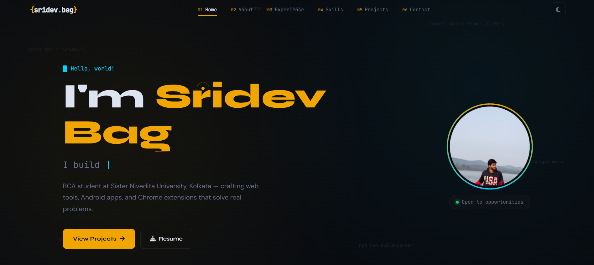

# 👨‍💻 Sridev Bag | Personal Portfolio

 
## 🚀 Overview

Welcome to my personal portfolio website! This project showcases my skills, academic projects, and experience as a **Software Developer** and **BCA Student**. It is designed to be fully responsive, interactive, and features a seamless contact form powered by EmailJS.

**Live Demo:** [Insert Your Vercel/GitHub Pages Link Here]

## ✨ Key Features

* **🎨 Modern UI/UX:** Clean, minimalist design using the "Poppins" font family.
* **🌓 Dark/Light Mode:** Built-in theme toggle with local state persistence.
* **📱 Fully Responsive:** Optimized for desktops, tablets, and mobile devices.
* **📧 Functional Contact Form:** Integrated with **EmailJS** to send emails directly from the browser without a backend server.
* **✨ Scroll Animations:** Smooth fade-in effects as you scroll down the page.
* **📄 Resume Download:** Direct link to download my CV.

## 🛠️ Tech Stack

| Technology | Usage |
| :--- | :--- |
| **HTML5** | Semantic structure and layout |
| **CSS3** | Styling, Flexbox, Grid, Variables, Animations |
| **JavaScript** | DOM Manipulation, EmailJS logic, Theme Toggling |
| **FontAwesome** | Icons for social links and UI elements |
| **EmailJS** | API for handling contact form submissions |

## 📂 File Structure

```text
├── assets/
│   ├── images/        # Profile pictures and project screenshots
│   ├── icons/         # Resume PDF
├── index.html         # Main HTML structure
├── style.css          # Global styles, themes, and media queries
├── script.js          # Logic for theme, EmailJS, and animations
└── README.md          # Project documentation
